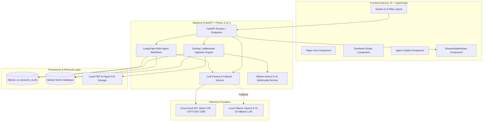
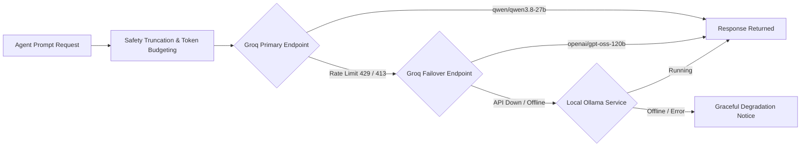

# 02. Architecture & Tech Stack

## 🏗️ System Architecture Overview

AI Research OS is built with a decoupled client-server architecture designed for high-performance academic processing, local privacy, and low-latency cloud inference.



---

## 💻 Frontend Stack (Next.js 15)

The frontend is located in [`frontend/`](file:///frontend) and runs on **Node.js** with **Next.js 15 (App Router)**.

### Core Technologies
- **Framework:** Next.js 15.2.0 (React 19, TypeScript).
- **Styling:** Tailwind CSS with customized academic slate color palette.
- **Icons:** `lucide-react` for clean, consistent academic iconography.
- **Markdown & Math Rendering:** `react-markdown`, `remark-gfm`, `remark-math`, `rehype-katex` for rendering LaTeX formulas and academic tables.
- **Streaming Component:** [`StreamedMarkdown.tsx`](file:///frontend/src/components/StreamedMarkdown.tsx) — Custom token accumulation and progressive rendering engine with typing cadence and an active blinking cursor (`animate-pulse`).

### Key Component Architecture
```
frontend/src/
├── app/
│   ├── layout.tsx         # Root layout with fonts and metadata
│   ├── page.tsx           # Master page coordinating the 3 Unified Pillars
│   └── globals.css        # Core design tokens, scrollbar styling, math styles
├── components/
│   ├── Navbar.tsx         # Sticky spy navigation with active section indicator
│   ├── PaperCard.tsx      # Academic paper card with tags, metadata, and actions
│   ├── PaperSummary.tsx   # Detailed modal with streamed summaries and key findings
│   ├── SynthesisStudio.tsx# Tabbed container for Compare, Review, Gaps, and Timeline
│   ├── ComparisonTable.tsx# Side-by-side paper analysis (Prose mode vs Table mode)
│   ├── LiteratureDraft.tsx# Theme-based literature review generator
│   ├── ResearchGaps.tsx   # Contradiction and unsolved question detector
│   ├── ResearchTimeline.tsx# Visual chronological evolution of the paper collection
│   ├── ChatInterface.tsx  # Multi-paper conversational RAG agent
│   └── StreamedMarkdown.tsx# Progressive streaming markdown renderer
└── lib/
    └── api.ts             # Typed Axios client interacting with FastAPI backend
```

---

## ⚙️ Backend Stack (FastAPI & Python)

The backend is located in [`backend/`](file:///backend) and powered by Python 3.11+.

### Core Technologies
- **Web Framework:** FastAPI with asynchronous ASGI endpoints and Uvicorn.
- **Orchestration:** LangGraph / LangChain for multi-agent workflows and stateful research reasoning.
- **Relational ORM:** SQLAlchemy with a local SQLite database (`ai_research_os.db`).
- **Vector Retrieval:** Qdrant Client with FastEmbed (`sentence-transformers/all-MiniLM-L6-v2`) generating 384-dimensional dense vectors.
- **PDF Extraction:**
  - **Docling:** Primary high-fidelity parser preserving multi-column layouts, tables, and section hierarchies.
  - **pdfplumber:** Resilient secondary parser fallback for malformed or scanned PDFs.
  - **Ollama Vision (`qwen2.5-vl`):** Multimodal deep understanding for paper figures, diagrams, and architecture charts.

### Relational Database Schema (`backend/app/models/`)
The SQLite database stores structured academic entities:
- **`Paper`:** ID, title, abstract, ArXiv ID, published date, journal, PDF storage path, citation count.
- **`Author`:** Name, affiliation, paper relations.
- **`Section`:** Paper sections (Introduction, Methodology, Experiments, Results, Discussion) with token offsets.
- **`Figure`:** Extracted images, captions, bounding boxes, and vision-generated summaries.
- **`Citation`:** Extracted bibliography references linking papers.
- **`ChatSession` & `ChatMessage`:** Persistent conversation history with paper references.

---

## 🤖 LLM Factory & Inference Layer

The LLM abstraction resides in [`backend/app/services/llm_factory.py`](file:///backend/app/services/llm_factory.py) and coordinates cloud inference and local fallbacks:



### Active Production Models
1. **Primary Cloud LLM:** `qwen/qwen3.8-27b` on Groq (ultra-fast 400+ tokens/sec inference, strong reasoning and markdown formatting).
2. **Failover Cloud LLM:** `openai/gpt-oss-120b` or `openai/gpt-oss-20b` on Groq.
3. **Local Multimodal Model:** `qwen2.5-vl` via Ollama for offline figure/table analysis.
4. **Local Text Fallback:** `llama3.2` or `mistral` via Ollama when no internet connection is available.

---

## 🪟 Windows Native Automation Layer

The repository is fully configured for effortless Windows operation without requiring Docker or manual terminal wrangling:

- **[`start_all.bat`](file:///c:/Users/yashp/Desktop/AI-%20Research%20Agent/start_all.bat):** Spawns two independent Windows console windows running the backend and frontend simultaneously.
- **[`start_backend.bat`](file:///c:/Users/yashp/Desktop/AI-%20Research%20Agent/start_backend.bat):** Checks Python, activates the virtual environment (`.\venv\Scripts\activate.bat`), sets UTF-8 console encoding (`chcp 65001`), verifies dependencies without reinstalling, and boots Uvicorn.
- **[`start_frontend.bat`](file:///c:/Users/yashp/Desktop/AI-%20Research%20Agent/start_frontend.bat):** Checks Node.js, validates `node_modules` without reinstalling, and launches `npm run dev`.
