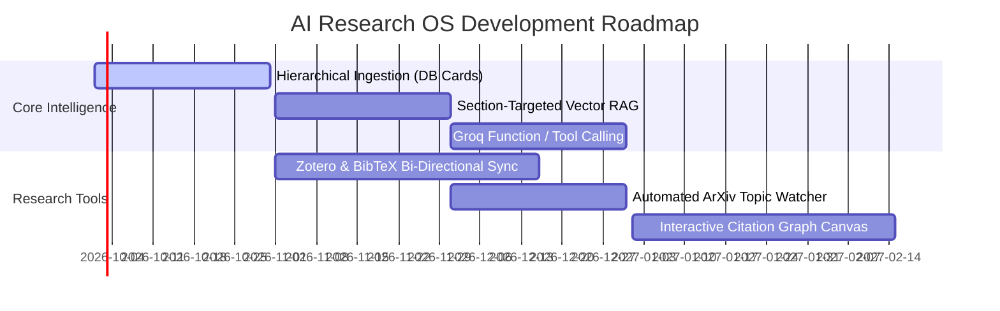

# 06. Past, Present & Future (Roadmap)

This document provides a chronological timeline and strategic roadmap of AI Research OS. It enables any newcomer or AI model to immediately understand the project's evolution, where we stand today, and what comes next.

---

## ⏳ The Past (v1.0: Experimental Prototype)

In the initial exploratory phase, the goal was proving whether multi-agent LLM workflows could ingest and synthesize academic literature.

### What Was Built:
- Basic PDF extraction using Docling and pdfplumber.
- LangGraph agents for paper reading, planning, and draft writing.
- 8 separate navigation tabs (*Overview*, *Papers*, *Compare*, *Review*, *Gaps*, *Timeline*, *Figures*, *Chat*).
- Initial reliance on Groq's `llama-3.3-70b-versatile`.

### What Held It Back:
- **Navigation Fatigue:** Users had to jump across 8 isolated screens to complete a single review.
- **Model Decommissioning:** Groq removed `llama-3.3-70b-versatile`, causing sudden API 404 errors.
- **Prompt Token Explosions:** Comparative synthesis dumped up to 36,000 characters of uncompressed paper text into prompts, crashing Groq's 8,000 TPM limit with 413/429 errors.
- **Flashing UI Text:** Responses arrived as instant, jarring blocks of text with no visual cadence or feedback.
- **Startup Script Lag:** Startup scripts ran `pip install` and `npm install` on every launch, stalling boots for 4+ minutes.

---

## ⚡ The Present (v2.0: Academic Ergonomics & Resilient Architecture)

The current release resolves the prototype flaws, adhering strictly to the clean, content-first principles of [`guide.txt`](file:///guide.txt).

### Current Milestones Achieved:
1. **The 3 Unified Pillars:** Consolidated 8 disjointed tabs into three cohesive, scroll-linked sections:
   - **Paper Hub (`#papers`)** — Library, drag-and-drop upload, ArXiv search, paper cards.
   - **Synthesis Studio (`#studio`)** — Tabbed container for Compare (Prose & Table), Literature Review, Gaps, and Timeline.
   - **Agent Copilot (`#copilot`)** — Academic conversational companion with paper grounding.
2. **Sticky Spy Navigation:** Clean top navbar with active section highlight and smooth anchor scrolling.
3. **Continuous LLM Generation:** [`StreamedMarkdown.tsx`](file:///frontend/src/components/StreamedMarkdown.tsx) renders streaming tokens progressively with an active pulsing cursor across Chat, Summaries, Compare Prose, Reviews, and Gaps.
4. **Modern Groq Inference Stack:** Active support for `qwen/qwen3.8-27b` (primary) and `openai/gpt-oss-120b` (failover), with local Ollama fallback logic.
5. **Prompt Budgeting & Truncation:** Paragraphs compacted to 750 chars (max 6 chunks); global prompts capped to ~12,000 chars to operate safely beneath the 8,000 TPM limit.
6. **Optimized Windows Launchers:** Native batch scripts (`start_all.bat`, `start_backend.bat`, `start_frontend.bat`) that start services in under 2 seconds without re-installing dependencies.

---

## 🔮 The Future (v3.0: Strategic Roadmap)

The upcoming milestones focus on deeper intelligence, zero information loss, and academic ecosystem integrations.

### 🎯 Milestone 1: Production Hierarchical Ingestion (Database Cards)
- **Goal:** Implement **Solution 2** from [`05_groq_token_limits_and_solutions.md`](file:///docs/05_groq_token_limits_and_solutions.md).
- At PDF ingestion time, automatically generate structured JSON research cards (`executive_summary`, `core_methodology`, `key_findings`, `stated_limitations`, `datasets_used`).
- Synthesis Studio tools will query these cards directly, reducing token consumption by 90% while retaining 100% of core factual metrics.

### 🎯 Milestone 2: Section-Targeted Semantic RAG
- **Goal:** Implement **Solution 1**.
- Tag all Qdrant vector chunks with section taxonomy (`intro`, `methods`, `results`, `limitations`).
- Enable agent workflows to perform targeted vector similarity searches filtered by section type.

### 🎯 Milestone 3: On-Demand Tool Calling on Groq
- **Goal:** Implement **Solution 3**.
- Equip `qwen/qwen3.8-27b` with native Python tool calling (`get_paper_metrics`, `search_paper_text`) so the model retrieves specific numbers dynamically instead of stuffing prompts.

### 🎯 Milestone 4: Reference Manager Integrations
- Bi-directional sync with **Zotero** libraries.
- Drag-and-drop `.bib` BibTeX file import and automatic citation export in APA, IEEE, and Chicago formats.

### 🎯 Milestone 5: Automated ArXiv Topic Watcher
- Background scheduled agent that periodically scans ArXiv for newly published preprints matching user-defined interest tags (e.g. *"diffusion models", "mechanistic interpretability"*).
- Generates a weekly digest card of breakthrough papers.

### 🎯 Milestone 6: Interactive Citation & Evolution Graph
- Interactive 2D/3D force-directed canvas visualizing paper relationships, cross-citations, and methodological lineage.
- Enables visual clustering of research paradigms.
